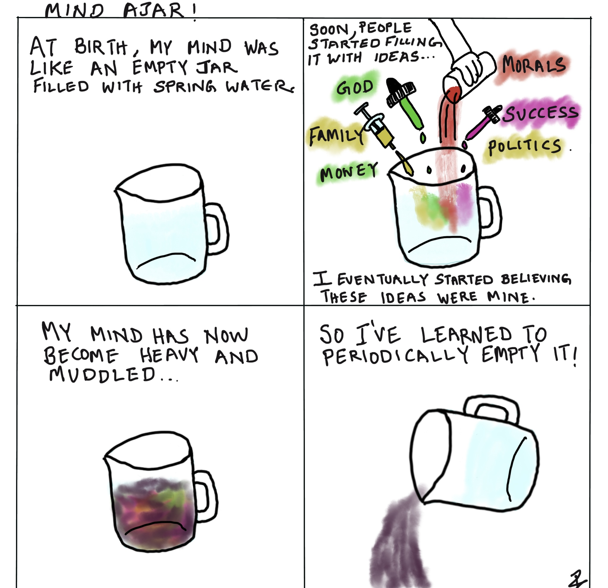

## Empty Your Self

Imagine a glass jar filled with water. Now add a drop of
red color and watch it turn a shade of red. Add another
color and it changes to another shade. Such is your
mind. It starts off colorless, quality- less. Every life
experience adds a little color to it. But your original
nature was colorless. Many of us have forgotten that.
The essential nature of color is that it fades away.
Being attached to a color only brings pain. Enjoy the
colors as they change, never forgetting that your
original nature is colorless and that clinging to a color is
futile and unnatural.

The idea of personality is based on two things. The first
is experience. You touch boiling water, you know it is hot.
Now you know that touching boiling water hurts, so you
refrain from doing this in the future. What you learn
through experience is what is commonly referred to as
fact. Then there is belief. You hear that a neighbor's dog is
aggressive and you may think that it is true without
verifying it. If it is a strong belief; the truer it becomes in
your mind. There is belief based on projection as well. For
instance, if you are walking down a narrow street and you
see the aforementioned neighbor's dog come from the
opposite side. You turn around and bolt because you think
that the dog will attack you. In fact, you are convinced that
the dog is chasing you as you run.

These two things, experience and belief, are the
foundation of what you call your personality. As you grow
up, experiences and beliefs accumulate in your mind-scape
like barnacles on a ship's hull. They affect your ability to
see the world as it is. The world you see is always colored
by your personality. ***Realize this and you won’t be attached to this
thing you call your personality or see a reason to defend or conform to
what you yourself have created over the years. Conflicts in life will
disappear as a result.***
